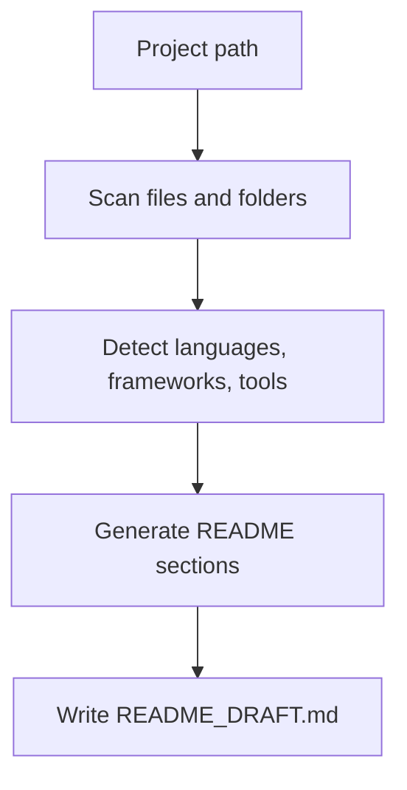

# Repo README Polisher

A lightweight CLI tool that scans a local project and generates a polished GitHub README draft.

> Built for developers who want a better first README without starting from a blank page.

## Why this exists

Most side projects have code before they have a story. `repo-readme-polisher` helps bridge that gap: it inspects a project directory, detects common stacks and project signals, then creates a structured `README_DRAFT.md` that you can edit into a GitHub-ready README.

It is intentionally lightweight: no API key, no cloud service, no heavy framework. The first version is rule-based and local-first; AI-assisted rewriting can be added later as an optional feature.

## Features

- Scan a local project directory
- Detect common languages and frameworks
- Recognize files like `package.json`, `pyproject.toml`, `pom.xml`, `Dockerfile`, and `.env.example`
- Generate a structured GitHub README draft
- Include quick start, testing, project structure, tech stack, roadmap, and license sections
- Work as a simple Python CLI with no runtime dependencies

## Tech Stack

- Python 3.10+
- Standard library only for runtime
- `argparse` for CLI parsing
- `pytest` for tests

## Quick Start

```bash
# Clone the repository
git clone https://github.com/ZeWeir/repo-readme-polisher.git
cd repo-readme-polisher

# Optional: create a virtual environment
python -m venv .venv
.venv\Scripts\activate  # Windows
# source .venv/bin/activate  # macOS/Linux

# Install in editable mode
python -m pip install -e .

# Generate a README draft for any local project
repo-readme-polisher path/to/your-project
```

You can also run it directly as a module:

```bash
python -m repo_readme_polisher path/to/your-project
```

By default, it writes:

```text
README_DRAFT.md
```

## Usage

Generate a draft for the current directory:

```bash
repo-readme-polisher .
```

Generate a draft for another project:

```bash
repo-readme-polisher ../my-project
```

Write to a custom output path:

```bash
repo-readme-polisher ../my-project -o docs/README_DRAFT.md
```

Print to stdout:

```bash
repo-readme-polisher ../my-project --stdout
```

Override the generated title:

```bash
repo-readme-polisher ../my-project --title "My Awesome Project"
```

## Example Output

See [`examples/README_DRAFT.sample.md`](examples/README_DRAFT.sample.md).

## Project Structure

```text
.
├── repo_readme_polisher/
│   ├── __init__.py
│   ├── __main__.py
│   ├── detector.py
│   ├── generator.py
│   └── scanner.py
├── examples/
│   └── README_DRAFT.sample.md
├── tests/
│   └── test_generator.py
├── pyproject.toml
├── README.md
├── LICENSE
└── .gitignore
```

## How it works



The scanner ignores common noisy directories like `.git`, `node_modules`, `dist`, `build`, `target`, `.venv`, and cache folders.

## Roadmap

- [ ] Add richer framework detection
- [ ] Add Markdown quality checks
- [ ] Add optional AI rewrite mode with `--ai`
- [ ] Add GitHub repository metadata support
- [ ] Add badges and screenshot suggestions
- [ ] Add config file support for custom README templates

## Development

Run tests:

```bash
python -m pytest
```

Generate a sample draft from this repository:

```bash
python -m repo_readme_polisher . -o examples/README_DRAFT.sample.md
```

## License

This project is licensed under the MIT License. See [LICENSE](LICENSE) for details.
