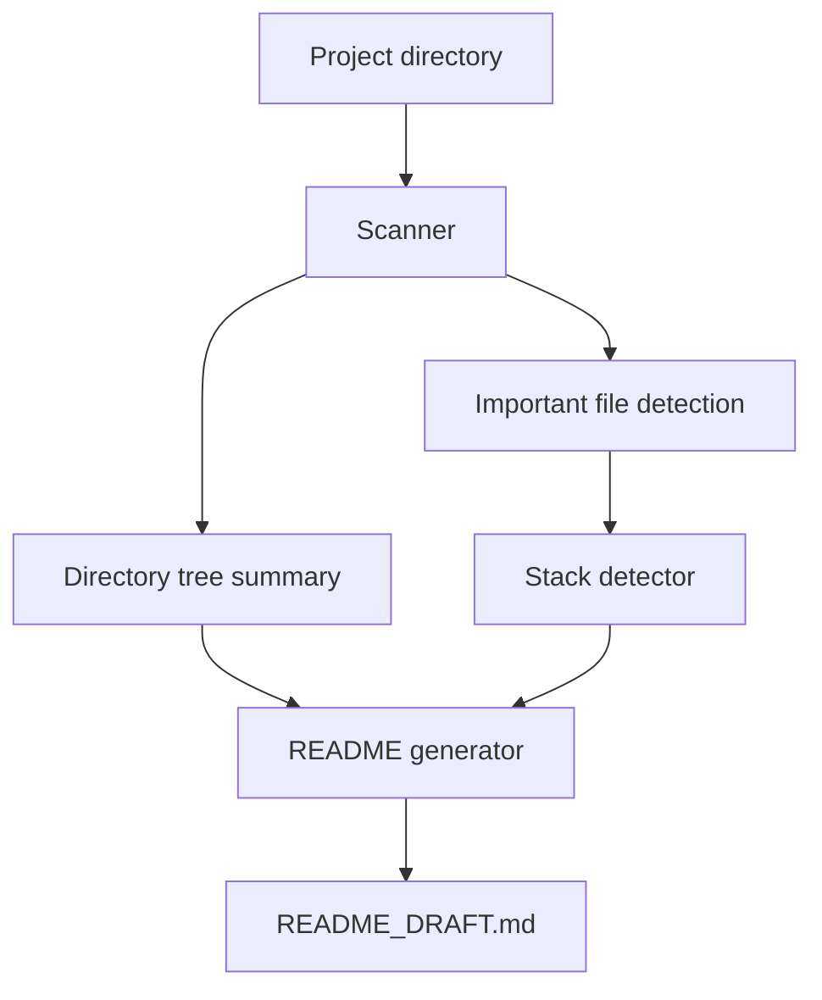

# Repo README Polisher

<p align="center">
  <strong>Turn a raw project folder into a polished GitHub README draft.</strong>
</p>

<p align="center">
  <a href="README.zh-CN.md">简体中文</a> ·
  <a href="#quick-start">Quick Start</a> ·
  <a href="#roadmap">Roadmap</a> ·
  <a href="CONTRIBUTING.md">Contributing</a>
</p>

<p align="center">
  
  
  
  
</p>

---

`repo-readme-polisher` is a lightweight CLI that scans a local project and generates a structured, GitHub-ready `README_DRAFT.md`.

It is designed for developers who already have code, but do not yet have a clear project story: features, tech stack, quick start, structure, roadmap, and portfolio-friendly highlights.

No API key. No cloud service. No lock-in. Just a local-first project scanner and README generator.

## Highlights

- **Local-first**: scans your project directory without sending files anywhere.
- **Zero runtime dependencies**: built with the Python standard library.
- **Stack-aware detection**: recognizes Python, JavaScript/TypeScript, Vue, React, Java, Spring Boot, Docker, and common package files.
- **GitHub-ready output**: generates sections for features, tech stack, quick start, testing, roadmap, and license.
- **Portfolio-friendly**: helps turn side projects into repositories that are easier to understand and present.

## Quick Start

```bash
git clone https://github.com/Zeweir/repo-readme-polisher.git
cd repo-readme-polisher

python -m pip install -e .
repo-readme-polisher path/to/your-project
```

Or run it directly as a module:

```bash
python -m repo_readme_polisher path/to/your-project
```

By default, the tool writes:

```text
README_DRAFT.md
```

## Usage

Generate a draft for the current directory:

```bash
repo-readme-polisher .
```

Generate a draft for another project:

```bash
repo-readme-polisher ../my-project
```

Write to a custom output path:

```bash
repo-readme-polisher ../my-project -o docs/README_DRAFT.md
```

Print to stdout:

```bash
repo-readme-polisher ../my-project --stdout
```

Override the generated title:

```bash
repo-readme-polisher ../my-project --title "My Awesome Project"
```

Generate a Chinese draft:

```bash
repo-readme-polisher ../my-project --lang zh
```

Generate JSON metadata:

```bash
repo-readme-polisher ../my-project --format json
```

Prepare an AI rewrite prompt:

```bash
repo-readme-polisher ../my-project --ai
```

## What it detects

| Signal | Examples |
| --- | --- |
| Languages | Python, JavaScript/TypeScript, Java, Vue, Go |
| Package files | `pyproject.toml`, `requirements.txt`, `package.json`, `pom.xml`, `build.gradle` |
| Frontend tools | React, Vue, Vite, Next.js, Tailwind CSS |
| Backend tools | Express, Fastify, Spring Boot |
| Databases | MySQL, PostgreSQL, Redis, MongoDB, vector databases |
| Testing | pytest, Jest, Vitest, Playwright, JUnit |
| Deployment hints | `Dockerfile`, `docker-compose.yml`, `.env.example`, Nginx, Vercel |
| Project hygiene | `LICENSE`, `tests/`, existing `README.md` |

## Example Output

See:

- [`examples/README_DRAFT.sample.md`](examples/README_DRAFT.sample.md)
- [`examples/README_DRAFT.zh-CN.sample.md`](examples/README_DRAFT.zh-CN.sample.md)
- [`examples/scan.sample.json`](examples/scan.sample.json)

## Architecture



## Project Structure

```text
.
├── .github/
│   ├── ISSUE_TEMPLATE/
│   └── workflows/
├── docs/
├── examples/
├── repo_readme_polisher/
│   ├── __init__.py
│   ├── __main__.py
│   ├── ai.py
│   ├── detector.py
│   ├── generator.py
│   ├── mcp_server.py
│   └── scanner.py
├── tests/
├── CHANGELOG.md
├── CODE_OF_CONDUCT.md
├── CONTRIBUTING.md
├── LICENSE
├── README.md
├── README.zh-CN.md
├── SECURITY.md
└── pyproject.toml
```

## MCP / Agent Integration

This repository includes an experimental MCP-style stdio server for agent workflows.

```bash
repo-readme-polisher-mcp
```

See [docs/MCP.md](docs/MCP.md) for request examples.

## Release Workflow

Version tags trigger the GitHub Actions release workflow:

```bash
git tag -a v0.5.0 -m "v0.5.0"
git push origin v0.5.0
```

See [docs/RELEASE.md](docs/RELEASE.md).

## Development

Run tests:

```bash
python -m pytest
```

Generate a sample draft from this repository:

```bash
python -m repo_readme_polisher . -o examples/README_DRAFT.sample.md
```

## Roadmap

- [x] Local project scanner
- [x] Rule-based stack detection
- [x] README draft generator
- [x] Example output
- [x] GitHub Actions CI
- [x] Bilingual README draft generation
- [x] Optional AI rewrite prompt mode with `--ai`
- [x] Experimental MCP-style agent integration
- [x] GitHub Release workflow
- [ ] Richer framework detection
- [ ] Markdown quality scoring
- [ ] Configurable README templates
- [ ] GitHub repository metadata support
- [ ] Badges and screenshot suggestions

## Contributing

Contributions are welcome. See [CONTRIBUTING.md](CONTRIBUTING.md) for setup and development guidelines.

If you want to propose a new detector, please include:

1. The files or dependency names to detect.
2. A small example project structure.
3. Expected README output.

## Security

This tool is designed to inspect local project metadata. It should not upload your files or secrets anywhere.

If you find a security issue, please see [SECURITY.md](SECURITY.md).

## License

This project is licensed under the MIT License. See [LICENSE](LICENSE) for details.
