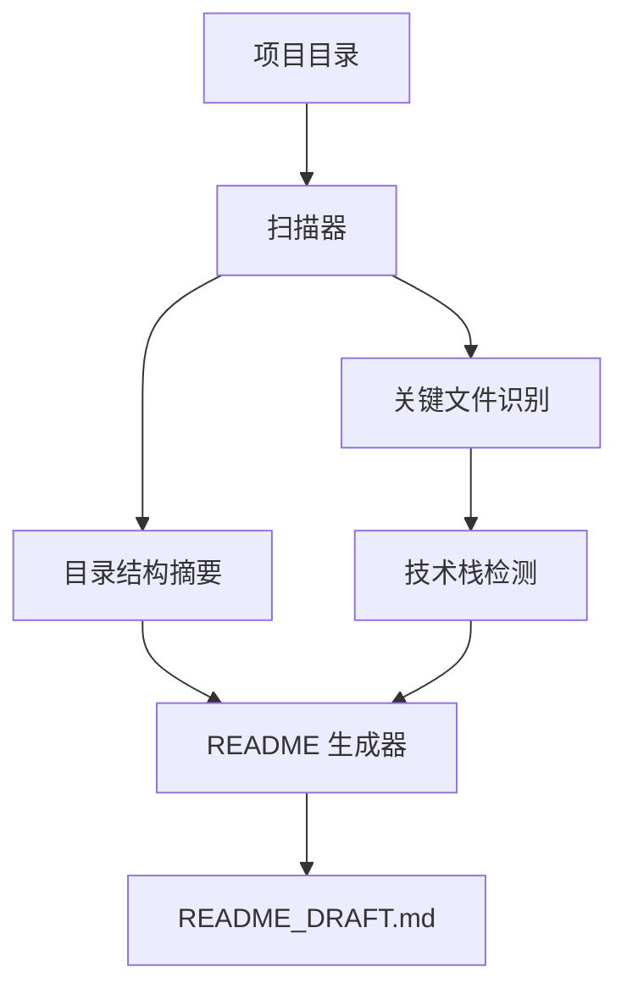

# Repo README Polisher

<p align="center">
  <strong>把一个普通项目目录，整理成更像样的 GitHub README 草稿。</strong>
</p>

<p align="center">
  <a href="README.md">English</a> ·
  <a href="#快速开始">快速开始</a> ·
  <a href="#路线图">路线图</a> ·
  <a href="CONTRIBUTING.md">贡献指南</a>
</p>

<p align="center">
  
  
  
  
</p>

---

`repo-readme-polisher` 是一个轻量级命令行工具，可以扫描本地项目目录，并生成结构清晰、适合 GitHub 展示的 `README_DRAFT.md`。

它适合那些“代码已经写了，但项目介绍还像半成品”的仓库：自动整理功能、技术栈、快速开始、项目结构、路线图和作品集亮点。

无需 API Key，不依赖云服务，不上传你的代码。第一版完全本地运行，基于规则扫描项目结构并生成 README 草稿。

## 项目亮点

- **本地优先**：只扫描本地目录，不把文件发送到外部服务。
- **零运行时依赖**：基于 Python 标准库实现。
- **技术栈感知**：识别 Python、JavaScript/TypeScript、Vue、React、Java、Spring Boot、Docker 等常见项目特征。
- **GitHub 友好输出**：自动生成功能、技术栈、快速开始、测试、路线图、许可证等章节。
- **适合作品集**：帮助把普通练手项目整理成更容易展示和讲清楚的仓库。

## 快速开始

```bash
git clone https://github.com/Zeweir/repo-readme-polisher.git
cd repo-readme-polisher

python -m pip install -e .
repo-readme-polisher path/to/your-project
```

也可以直接用模块方式运行：

```bash
python -m repo_readme_polisher path/to/your-project
```

默认会生成：

```text
README_DRAFT.md
```

## 使用方式

为当前目录生成草稿：

```bash
repo-readme-polisher .
```

为其他项目生成草稿：

```bash
repo-readme-polisher ../my-project
```

指定输出路径：

```bash
repo-readme-polisher ../my-project -o docs/README_DRAFT.md
```

输出到终端：

```bash
repo-readme-polisher ../my-project --stdout
```

指定项目标题：

```bash
repo-readme-polisher ../my-project --title "My Awesome Project"
```

## 能识别什么

| 类型 | 示例 |
| --- | --- |
| 语言 | Python、JavaScript/TypeScript、Java、Vue、Go |
| 包管理/构建文件 | `pyproject.toml`、`requirements.txt`、`package.json`、`pom.xml`、`build.gradle` |
| 前端工具 | React、Vue、Vite、Next.js、Tailwind CSS |
| 后端工具 | Express、Fastify、Spring Boot |
| 部署线索 | `Dockerfile`、`docker-compose.yml`、`.env.example` |
| 项目规范 | `LICENSE`、`tests/`、已有 `README.md` |

## 示例输出

查看 [`examples/README_DRAFT.sample.md`](examples/README_DRAFT.sample.md)。

## 架构



## 项目结构

```text
.
├── .github/
│   ├── ISSUE_TEMPLATE/
│   └── workflows/
├── docs/
├── examples/
├── repo_readme_polisher/
│   ├── __init__.py
│   ├── __main__.py
│   ├── detector.py
│   ├── generator.py
│   └── scanner.py
├── tests/
├── CHANGELOG.md
├── CODE_OF_CONDUCT.md
├── CONTRIBUTING.md
├── LICENSE
├── README.md
├── README.zh-CN.md
├── SECURITY.md
└── pyproject.toml
```

## 开发

运行测试：

```bash
python -m pytest
```

从当前仓库生成示例草稿：

```bash
python -m repo_readme_polisher . -o examples/README_DRAFT.sample.md
```

## 路线图

- [x] 本地项目扫描器
- [x] 规则式技术栈检测
- [x] README 草稿生成器
- [x] 示例输出
- [x] GitHub Actions CI
- [ ] 更丰富的框架识别
- [ ] Markdown 质量评分
- [ ] 可配置 README 模板
- [ ] 可选 AI 改写模式：`--ai`
- [ ] GitHub 仓库元数据支持
- [ ] 徽章和截图建议

## 贡献

欢迎贡献。请查看 [CONTRIBUTING.md](CONTRIBUTING.md)。

如果你想新增检测器，请尽量提供：

1. 要检测的文件或依赖名称；
2. 一个最小项目结构示例；
3. 期望生成的 README 内容。

## 安全

本工具只应读取本地项目元数据，不应上传你的文件或密钥。

如果你发现安全问题，请查看 [SECURITY.md](SECURITY.md)。

## 许可证

本项目基于 MIT License 开源。详见 [LICENSE](LICENSE)。
