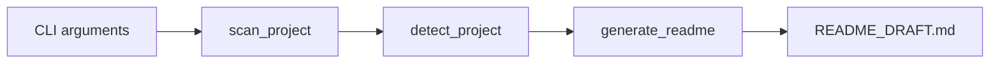

# Architecture

`repo-readme-polisher` is intentionally small and easy to reason about.

## Pipeline

## Modules

- `scanner.py`: walks the target directory, filters noisy folders, collects important files.
- `detector.py`: infers languages, frameworks, package managers, commands, and project features.
- `generator.py`: turns scan results into a Markdown README draft.
- `__main__.py`: exposes the command-line interface.

## Design principles

- Local-first.
- No runtime dependencies.
- Deterministic output.
- Easy to extend with new detectors.
- Safe by default: inspect metadata, do not execute target project code.
