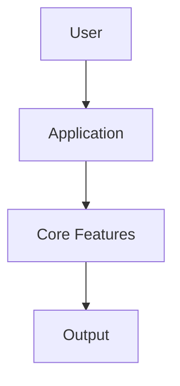

# Repo Readme Polisher

A polished GitHub README draft generated from the local project structure.

> Replace this paragraph with a sharper one-sentence pitch: what the project does, who it is for, and why it is useful.

## Preview

Add screenshots, a GIF, or a demo link here.

## Features

- Open-source license included
- Test directory present
- Clean project summary generated from local files
- Quick-start section prepared for GitHub visitors

## Tech Stack

| Category | Detected |
| --- | --- |
| Languages | Python |
| Frameworks | Not detected yet |
| Package/build tools | pip / build backend |
| Databases | Not detected yet |
| Testing | Not detected yet |
| Deployment | Not detected yet |

## Project Structure

```text
.
├── .github
│   ├── .github/ISSUE_TEMPLATE
│   ├── .github/workflows
├── docs
├── examples
├── repo_readme_polisher
├── tests
│   │   ├── .github/ISSUE_TEMPLATE/bug_report.yml
│   │   ├── .github/ISSUE_TEMPLATE/feature_request.yml
│   ├── .github/PULL_REQUEST_TEMPLATE.md
│   │   ├── .github/workflows/ci.yml
├── .gitignore
├── CHANGELOG.md
├── CODE_OF_CONDUCT.md
├── CONTRIBUTING.md
│   ├── docs/ARCHITECTURE.md
│   ├── examples/README_DRAFT.ai.sample.md
│   ├── examples/README_DRAFT.sample.md
│   ├── examples/README_DRAFT.zh-CN.sample.md
│   ├── examples/scan.sample.json
├── LICENSE
├── pyproject.toml
├── README.md
├── README.zh-CN.md
│   ├── repo_readme_polisher/__init__.py
│   ├── repo_readme_polisher/__main__.py
│   ├── repo_readme_polisher/ai.py
│   ├── repo_readme_polisher/detector.py
│   ├── repo_readme_polisher/generator.py
│   ├── repo_readme_polisher/scanner.py
├── SECURITY.md
│   ├── tests/test_ai.py
│   ├── tests/test_generator.py
```

## Quick Start

```bash
# 1. Clone the repository
git clone <your-repo-url>
cd repo-readme-polisher

# 2. Install dependencies
# TODO: add install command

# 3. Run the project
python -m <module>
```

## Testing

```bash
python -m pytest
```

## Environment Variables

If the project uses environment variables, create a `.env` file from `.env.example`:

```bash
cp .env.example .env
```


## Architecture



## Technical Highlights

- Detected languages: Python
- Detected frameworks/tools: Not detected yet
- Detected databases: Not detected yet
- Deployment hints: Not detected yet
- Generated from a structure-aware scan instead of a blank template

## Roadmap

- [ ] Add screenshots/demo GIF
- [ ] Expand installation instructions
- [ ] Document API or CLI usage
- [ ] Add tests and CI workflow
- [ ] Polish the project description for portfolio/resume usage

## License

This project is licensed under the MIT License. See [LICENSE](LICENSE) for details.
