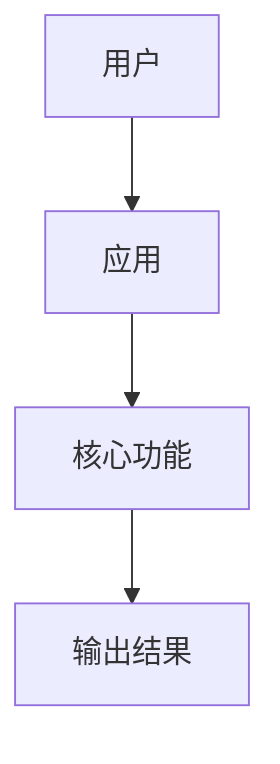

# Repo Readme Polisher

一份根据本地项目结构生成的 GitHub README 草稿。

> 请把这段替换成更准确的一句话介绍：这个项目做什么、给谁用、为什么有用。

## 预览

在这里添加截图、GIF 或在线演示链接。

## 功能

- Open-source license included
- Test directory present
- 根据本地文件生成项目摘要
- 生成适合 GitHub 访问者阅读的快速开始章节

## 技术栈

| 类别 | 检测结果 |
| --- | --- |
| 语言 | Python |
| 框架 | Not detected yet |
| 包管理/构建工具 | pip / build backend |
| 数据库 | Not detected yet |
| 测试 | Not detected yet |
| 部署 | Not detected yet |

## 项目结构

```text
.
├── .github
│   ├── .github/ISSUE_TEMPLATE
│   ├── .github/workflows
├── docs
├── examples
├── repo_readme_polisher
├── tests
│   │   ├── .github/ISSUE_TEMPLATE/bug_report.yml
│   │   ├── .github/ISSUE_TEMPLATE/feature_request.yml
│   ├── .github/PULL_REQUEST_TEMPLATE.md
│   │   ├── .github/workflows/ci.yml
├── .gitignore
├── CHANGELOG.md
├── CODE_OF_CONDUCT.md
├── CONTRIBUTING.md
│   ├── docs/ARCHITECTURE.md
│   ├── examples/README_DRAFT.sample.md
│   ├── examples/scan.sample.json
├── LICENSE
├── pyproject.toml
├── README.md
├── README.zh-CN.md
│   ├── repo_readme_polisher/__init__.py
│   ├── repo_readme_polisher/__main__.py
│   ├── repo_readme_polisher/detector.py
│   ├── repo_readme_polisher/generator.py
│   ├── repo_readme_polisher/scanner.py
├── SECURITY.md
│   ├── tests/test_generator.py
```

## 快速开始

```bash
# 1. 克隆仓库
git clone <your-repo-url>
cd repo-readme-polisher

# 2. 安装依赖
# TODO: 添加安装命令

# 3. 运行项目
python -m <module>
```

## 测试

```bash
python -m pytest
```

## 环境变量

如果项目使用环境变量，可以从 `.env.example` 创建 `.env`：

```bash
cp .env.example .env
```


## 架构



## 技术亮点

- 检测到的语言：Python
- 检测到的框架/工具：Not detected yet
- 检测到的数据库：Not detected yet
- 部署线索：Not detected yet
- 基于项目结构生成，而不是空白模板

## 路线图

- [ ] 添加截图或演示 GIF
- [ ] 完善安装说明
- [ ] 补充 API 或 CLI 使用文档
- [ ] 添加测试和 CI 工作流
- [ ] 优化成适合作品集/简历展示的项目描述

## 许可证

本项目基于 MIT License 开源。详见 [LICENSE](LICENSE)。
